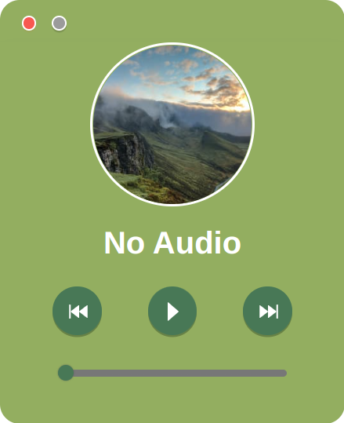

<div>
  English |
  <a href="README_zh-CN.md">简体中文</a>
</div>

<br/>

<div align="center">
  
</div>

<div align="center">
  <h1>Light Music</h1>
</div>

<p align="center">A cross-platform minimalist style music player</p>

<p align="center">
  
  
  
</p>

<br/>

<div align="center">
  
</div>

# ✨ Features

- 🚢 Cross Platform. Compatible with macOS, Windows, and Linux
- 📐 Simple interface. Less is more
- 🚀 Powered by <a href="https://reactjs.org/">React</a>, <a href="https://vitejs.dev/">Vite</a>, and <a href="https://www.electronjs.org/">Electron</a>


# ⚙ Run

## Clone the code

```bash
$ git clone https://github.com/jinsuichen/LightMusic.git
```

## Install

```bash
$ npm install
```

## Develop

```bash
$ npm run dev
```

## Build

```bash
# For Windows
$ npm run build:win

# For macOS
$ npm run build:mac

# For Linux
$ npm run build:linux
```

# 📜 License

GPL V3
