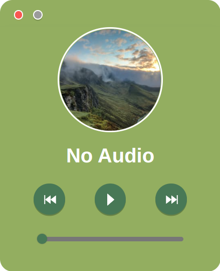

<div>
  <a href="README.md">English</a> |
  简体中文
</div>

<br/>

<div align="center">
  
</div>

<div align="center">
  <h1>Light Music</h1>
</div>

<p align="center">一个跨平台极简主义音乐播放器</p>

<p align="center">
  
  
  
</p>

<br/>

<div align="center">
  
</div>

# ✨ 特色

- 🚢 跨平台构建，支持 Windows、Linux、macOS
- 📐 界面简洁，以少胜多
- 🚀 主要使用 <a href="https://reactjs.org/">React</a>、 <a href="https://vitejs.dev/">Vite</a> 和 <a href="https://www.electronjs.org/">Electron</a> 等技术

# ⚙ 项目构建

## Clone 这个仓库

```bash
$ git clone https://github.com/jinsuichen/light-music.git
```

## 安装依赖包

```bash
$ npm install
```

## 开发模式运行

```bash
$ npm run dev
```

## 多平台编译

```bash
# For Windows
$ npm run build:win

# For macOS
$ npm run build:mac

# For Linux
$ npm run build:linux
```

# 📜 开源许可证

GPL V3
